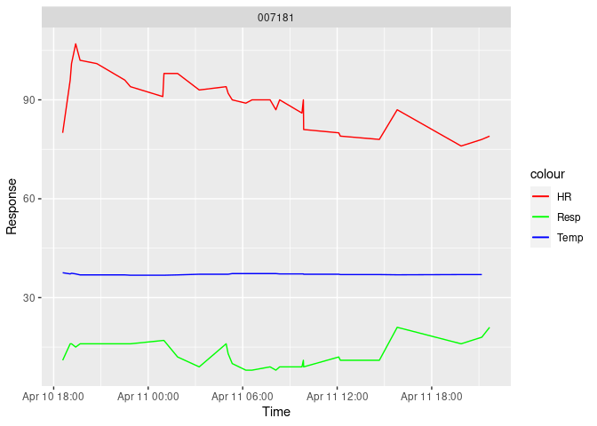

# Up-to-date ICU status reports
Gretchen North

## Background Information

Up-to-date patient information for 50 randomly-sampled patients in the
ICU. Comparative statistics for patient physiological measures including
heart rate (HR), temperature (Temp), and respiratory rate (Resp).

### Report last updated:

2023-06-23 04:09:22

## Physio Measures for Sampled Sepsis Patients

- A table listing the patients who currently have sepsis (if any), along
  with their most recent heart rate, temperature, and respiratory rate

  - Note: If the below table is empty, this indicates that no patients
    from the most recent, randomly-sampled dataset are currently
    affected by sepsis.

| PatientID |  HR | Temp | Resp |
|:----------|----:|-----:|-----:|

- Plots for all patients who have sepsis (if any) that show the complete
  history of their heart rate, temperature, and respiratory rate during
  their time in the ICU.

<!-- -->

    Warning: Removed 2 rows containing missing values (`geom_line()`).

## 

- A table showing the *change* in heart rate, temperature, and
  respiratory rate between the last two measurements for all patients

| PatientID | Change in Heart Rate | Change in Temperature | Change in Respiratory Rate |
|:----------|---------------------:|----------------------:|---------------------------:|
| 007181    |                    4 |                    NA |                         -2 |
